# Patrick Hollyer-Viggiani – Portfolio

## 👋 Introduction
I am a Computer Programming and Analysis student with experience in full-stack web development, object-oriented programming, mobile development, and database design. This portfolio highlights key projects completed throughout my program, demonstrating both my technical skills and my ability to learn and apply new technologies.

Each project includes an overview, technologies used, key features, and a reflection on what I learned and how it demonstrates my abilities as a computer programmer analyst.

---

# 📁 Projects

## 1. Product Showcase Web Application (Next.js)

### Overview
A full-stack web application built using Next.js and React, designed to display and manage products using a headless CMS approach.

### Tech Stack
- Next.js
- React
- REST APIs
- Contentful (Headless CMS)
- JWT Authentication

### Key Features
- Dynamic product rendering using SSG, SSR, and CSR
- Role-Based Access Control (Admin, Author, User)
- Secure JWT authentication system
- Decoupled architecture using a headless CMS

### Project Access
Screenshots and implementation details provided below. Source code available upon request.

### Screenshots
The following screenshots highlight key functionality and user workflows within the application:

**Admin Dashboard**
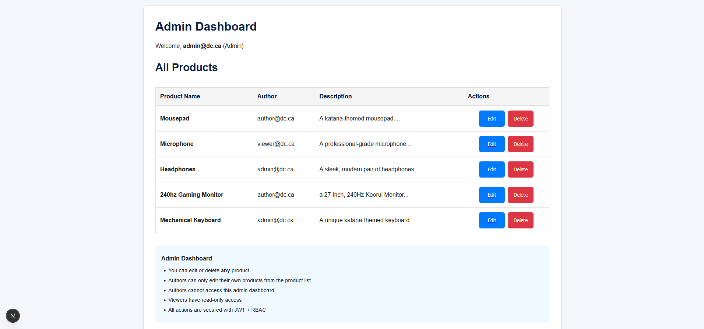

**Homepage**
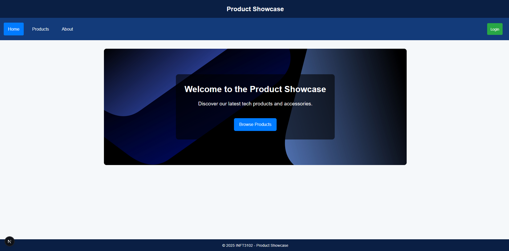

**Product Listing**
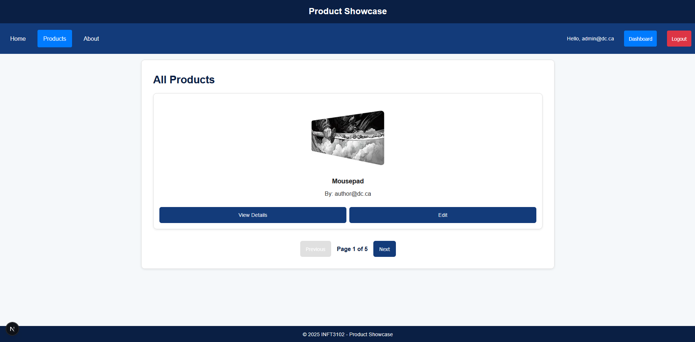

**Individual Product View**
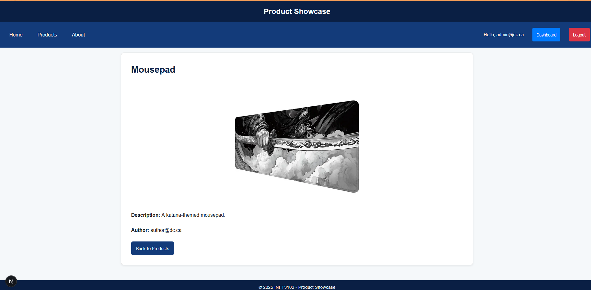

### What I Learned
Through this project, I developed a strong understanding of modern web architecture, including the differences between SSG, SSR, and CSR and their impact on performance and SEO. I also gained experience implementing secure authentication systems using JWT and designing role-based access control across both frontend and backend.

### Why This Demonstrates CPA Skills
This project demonstrates my ability to design and implement scalable, secure, and maintainable web applications. It highlights my understanding of full-stack development, API integration, and modern architectural patterns.

---

## 2. Hearts Card Game (C#)

### Overview
A multiplayer Hearts card game developed in C# using object-oriented programming principles, featuring both standard and advanced AI opponents.

### Tech Stack
- C#
- .NET
- Object-Oriented Programming

### Key Features
- Fully functional Hearts game with rule enforcement
- Multiple AI difficulty levels (standard and advanced)
- Dynamic turn management and scoring system
- Modular class design for scalability

### Project Access
Screenshots and class structure explanations provided. Developed as part of a team project.

### Screenshots
The following screenshots demonstrate gameplay and core functionality:

**Game Start Screen**
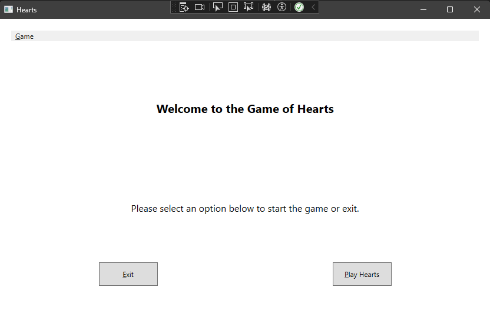

**Gameplay Screen**
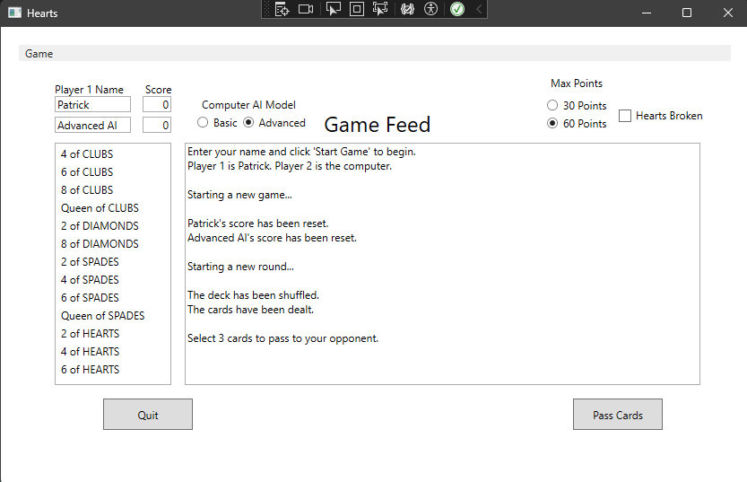

### What I Learned
This project strengthened my understanding of object-oriented programming principles such as inheritance, encapsulation, and polymorphism. I also gained experience designing and implementing AI logic and managing complex game states.

### Why This Demonstrates CPA Skills
This project demonstrates my ability to design structured, maintainable systems using OOP principles. It also highlights my problem-solving skills and ability to work collaboratively in a team environment.

---

## 3. AthleteGuard – Athlete Risk & Injury Tracker

### Overview
A full-stack web application built using Spring Boot and Java to track athlete training sessions and calculate injury risk using the ACWR model.

### Tech Stack
- Java
- Spring Boot
- Thymeleaf
- PostgreSQL
- JPA (Hibernate)

### Key Features
- Athlete training session tracking
- ACWR-based injury risk calculation
- Role-Based Access Control (Athlete vs Coach)
- MVC architecture with clear separation of concerns

### Project Access
Screenshots and architectural breakdown provided. Source code available upon request.

### Screenshots
The following screenshots demonstrate core system functionality from a coach's perspective:

**Athlete Overview Page**
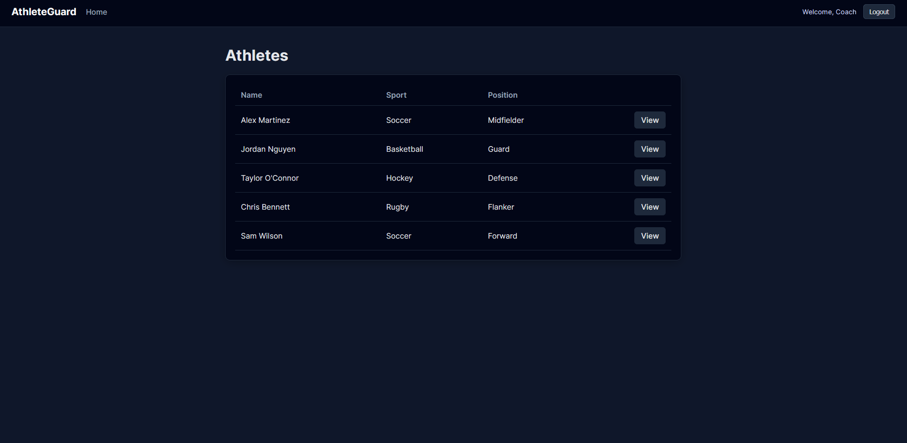

**Training Sessions View**
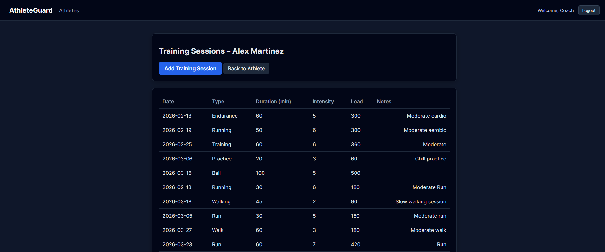

**Add Training Session**
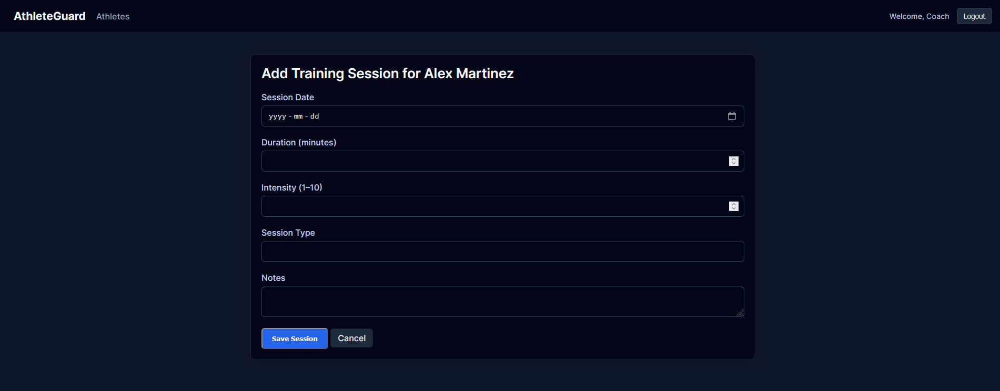

### What I Learned
I gained experience building enterprise-level backend systems using Spring Boot and implementing MVC architecture. I also learned how to structure applications using services, repositories, and entities, as well as how to interact with databases using JPA.

### Why This Demonstrates CPA Skills
This project demonstrates my ability to build scalable backend systems, apply design patterns, and implement real-world business logic. It also highlights my understanding of database integration and system architecture.

---

## 4. Mobile Student Organizer Application

### Overview
A mobile application built using Flutter that allows students to manage their academic information, including grades, assignments, and schedules.

### Tech Stack
- Dart
- Flutter
- Supabase

### Key Features
- User authentication system
- Dashboard displaying student-specific data
- Grade, assignment, and schedule tracking
- Customizable settings (dark mode, time format, text size)

### Project Access
Screenshots included below to demonstrate application functionality.

### Screenshots
The following screenshots illustrate the user experience and application flow:

**Login Screen** 
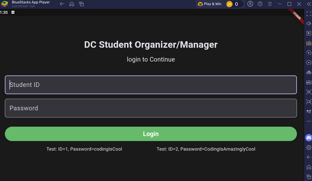

**Home Dashboard** 
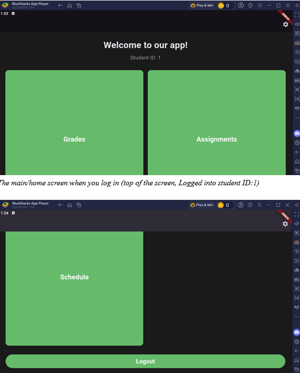

**Assignments View** 
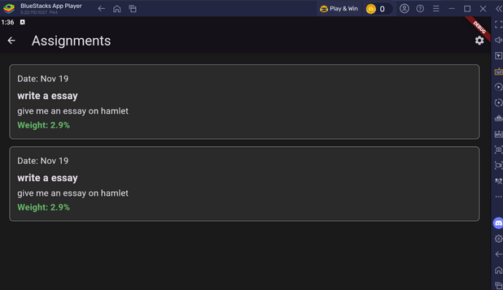

**Grades View** 
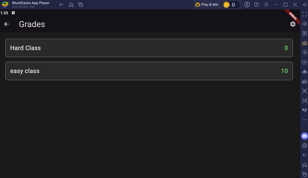

**Schedule View** 
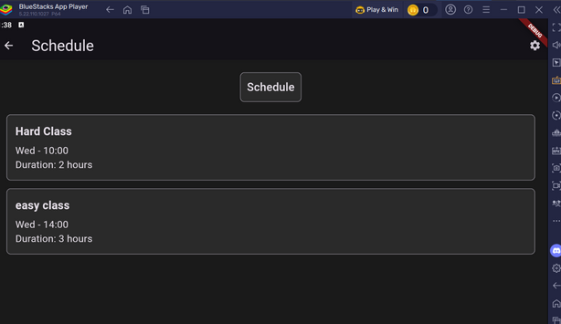

### What I Learned
Through this project, I developed an understanding of mobile application development, including UI/UX design considerations and state management. I also gained experience integrating Supabase for authentication and data storage.

### Why This Demonstrates CPA Skills
This project demonstrates my ability to develop cross-platform mobile applications and adapt to new technologies. It also highlights my focus on user experience and interface design.

---

## 5. Aunt Rosie’s Pies and Preserves Website

### Overview
A full-stack e-commerce web application built using Next.js and Supabase, with a strong focus on database design and normalization.

### Tech Stack
- Next.js
- React
- Supabase

### Key Features
- Product browsing and cart functionality
- Order processing system
- Role-Based Access Control (Admin, Financial, User)
- Complex relational database with 20+ tables
- Admin dashboards for business operations (in progress)

### Project Access
Screenshots and database design explanation provided. Source code available upon request.

### Screenshots
The following screenshots demonstrate the e-commerce workflow and user experience:

**Homepage**
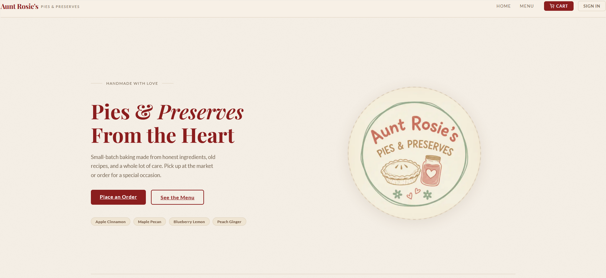

**Product Listings**
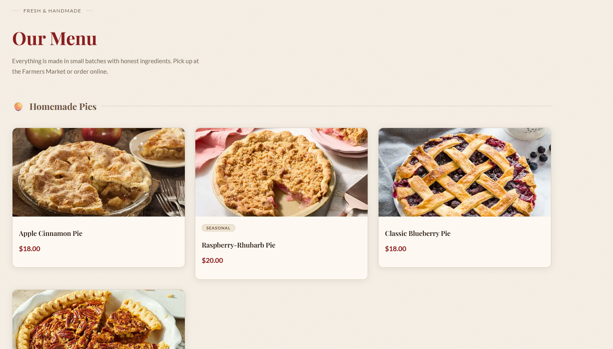

**Product Detail Page**
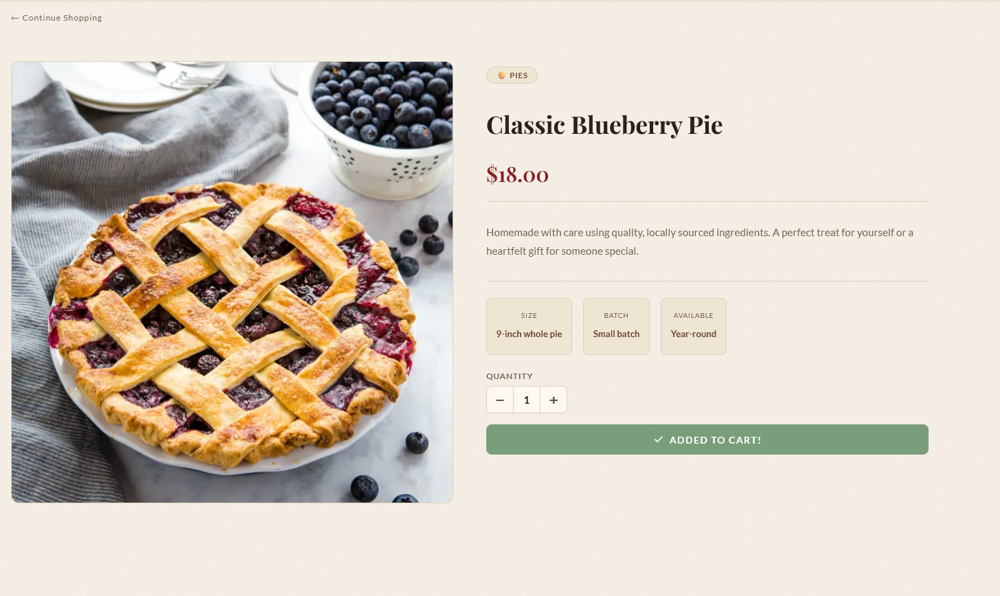

**Cart View**
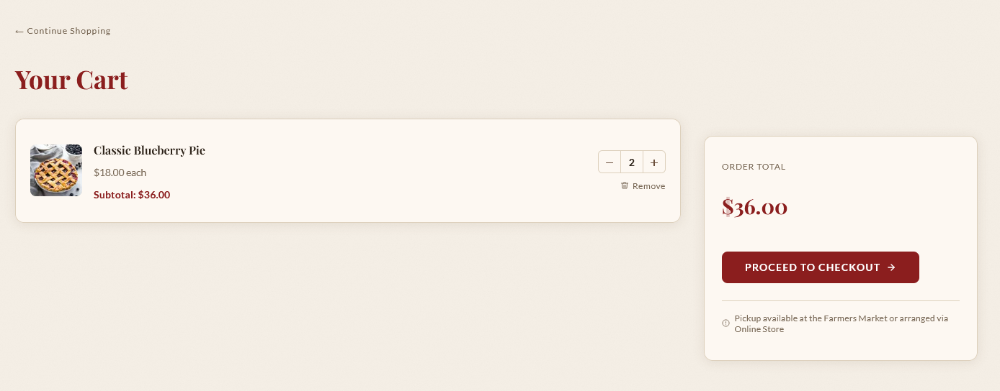

**Admin Pannel**
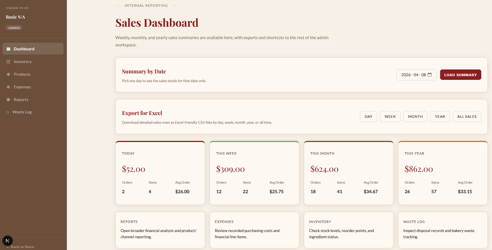

### What I Learned
This project significantly strengthened my database design skills, particularly in normalization and managing complex relationships. I also gained experience integrating frontend applications with backend databases and implementing role-based systems.

### Why This Demonstrates CPA Skills
This project demonstrates my ability to design and implement data-driven applications, manage complex relational databases, and build scalable full-stack systems.

---

# 🎓 Program Learning Outcomes & Employability Skills

## CPA Program Learning Outcomes Demonstrated

Across these projects, I have demonstrated the following key Computer Programming and Analysis (CPA) Program Learning Outcomes:

- **Application Development** – Designed and developed full-stack, mobile, and backend applications across multiple technologies.
- **Object-Oriented Programming** – Applied OOP principles such as encapsulation, inheritance, and polymorphism in the Hearts game and backend systems.
- **Database Design & Management** – Designed and implemented normalized relational databases, particularly in the Aunt Rosie and AthleteGuard projects.
- **Systems Analysis & Design** – Structured applications using architectural patterns such as MVC and component-based design.
- **Web Development** – Built modern web applications using frameworks like Next.js, React, and Spring Boot.
- **Security Practices** – Implemented authentication and authorization using JWT and role-based access control.
- **Problem Solving** – Solved complex logic problems such as game rule enforcement, workload calculations, and data flow management.
- **Integration of Technologies** – Integrated APIs, databases, and frontend frameworks to create complete systems.
- **Testing & Debugging** – Identified and resolved issues in both frontend and backend environments.
- **Professional Practices** – Worked in team environments and followed structured development approaches.

---

## Essential Employability Skills Demonstrated

These projects also demonstrate Ontario’s Essential Employability Skills:

- **Communication** – Clearly documented projects and explained technical concepts through this portfolio.
- **Problem Solving** – Designed solutions for real-world problems such as injury tracking and e-commerce workflows.
- **Critical Thinking** – Evaluated different approaches, such as authentication methods and database design decisions.
- **Information Management** – Organized and managed data effectively across multiple systems and applications.
- **Personal Responsibility & Adaptability** – Learned new technologies such as Spring Boot, Flutter, and Supabase independently and applied them successfully.

---

# 🏁 Conclusion

These projects collectively demonstrate my ability to design, develop, and deploy applications across multiple domains, including web, mobile, and backend systems. They highlight my strengths in problem-solving, adaptability, and continuous learning, all of which are essential skills for a Computer Programmer Analyst.
